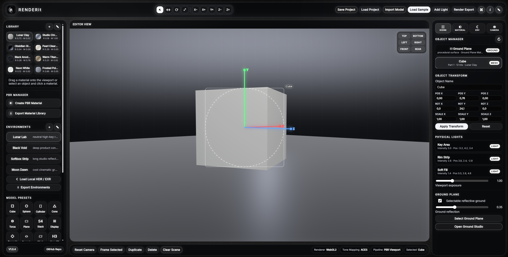
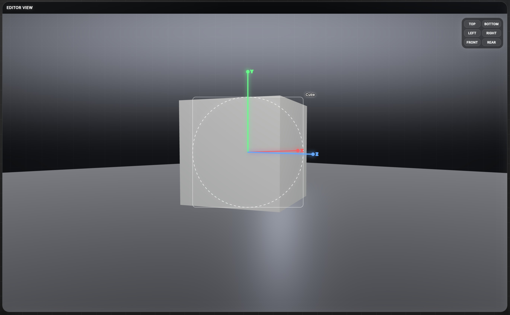
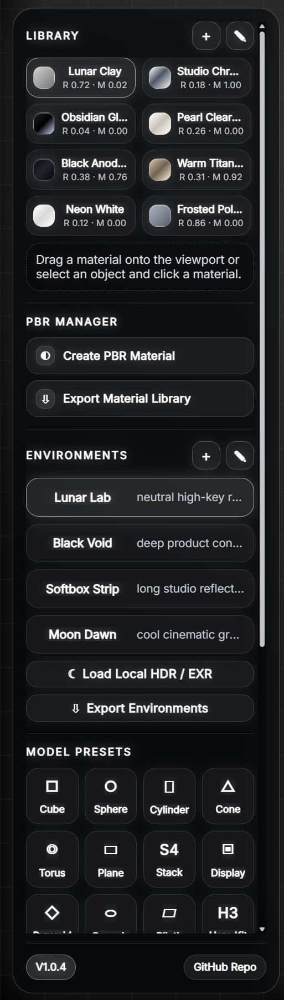
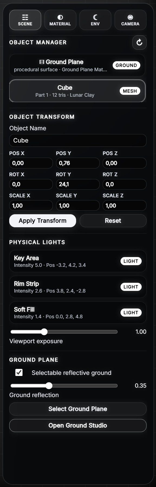

# RENDERit Static Web PBR Scene Visualizer

RENDERit is a lightweight static browser-based visualization tool for arranging imported 3D models, assigning PBR-style materials, configuring environments, tuning camera views and exporting rendered scene previews.

---

## Prerequisites

### 1. Browser

Use a modern browser with WebGL2 support:

- Microsoft Edge
- Google Chrome / Chromium
- Mozilla Firefox

Hardware acceleration should be enabled in the browser for best viewport performance.

### 2. Python

A local webserver is recommended because browsers may block Markdown loading, texture previews, local asset fetches or module-style workflows when opening `index.html` directly from disk.

Python 3.12+ is recommended for the included Windows starter.

#### Option A: Install Python via Windows Package Manager

```cmd
winget install Python.Python.3.12
```

#### Option B: Use the official Python installer

```text
https://www.python.org/downloads/windows/
```

#### Option C: Use Python Manager

```text
https://docs.python.org/dev/using/windows.html
```

---

## Previews






---

## Start

Use the included Windows starter:

```bat
start_RENDERit.bat
```

Then open:

```text
http://127.0.0.1:8888/
```

The starter launches a local static webserver from the project directory. Any other static webserver can be used as well, as long as the project root is served as the web root.

---

## Controls

| Action | Input |
|---|---|
| Orbit camera | Alt + left mouse drag |
| Pan camera | Alt + middle mouse drag |
| Dolly / zoom camera | Alt + right mouse drag |
| Zoom | Mouse wheel |
| Select object | Select tool + click object |
| Move selected object | Move tool + drag in viewport |
| Rotate selected object | Rotate tool + drag in viewport |
| Scale selected object | Scale tool + drag in viewport |
| Frame all objects | Use the left panel tool |
| Center selection | Use the left panel tool |

The same control summary is available inside the application through the **Controls** button in the top right.

---

## Important Notes

- RENDERit is a static local web application and does not require Node.js, npm, Electron or a database.
- The app is intended to run offline after the ZIP has been extracted.
- Keep all vendor assets local if the app should stay CDN-free.
- The included local vendor folders are prepared for offline runtime assets and third-party library files.
- Imported OBJ files are parsed locally in the browser.
- OBJ groups and object declarations are listed as separate entries in the Object Manager where possible.
- The ground plane is selectable and can receive its own material and texture.
- PBR texture slots are available for material authoring workflows.
- Render export uses the active browser canvas and writes image files through browser download APIs.
- Browser WebGL limitations apply. Very large models or high-resolution textures may reduce performance.

---

## Main Features

### PBR Scene View

RENDERit provides a dark, high-contrast scene editor with a Lunar Neon interface. The main viewport is optimized for fast visual feedback and scene blocking rather than slow offline raytracing.

The current static build focuses on practical browser-side rendering, material preview, environment control, object placement and render-style image export.

---

### Object Manager

Imported and generated objects appear in the scene hierarchy. Objects can be selected from the viewport or from the manager.

Supported object workflows include:

- selecting meshes
- selecting the ground plane
- reading object transform data
- editing position, rotation and scale
- applying materials
- framing the scene
- centering the selected object

---

### Transform Tools

The top toolbar provides direct scene arrangement tools:

| Tool | Purpose |
|---|---|
| Select | Pick objects in the viewport. |
| Move | Translate the selected object. |
| Rotate | Rotate the selected object. |
| Scale | Resize the selected object. |

Transform values can also be adjusted numerically from the right Scene panel.

---

### Ground Plane

The ground plane is treated as a real scene object. It can be selected, styled and used as a visual base for product-style renders.

Ground options include:

- base color
- roughness
- metalness
- texture upload
- texture repeat
- object selection
- material assignment

---

### Material Studio

The material workflow is designed for quick look development.

Available material actions include:

- create material
- edit material
- delete material
- assign material to selected object
- import texture channels
- export the material library
- manage color, roughness, metalness, emissive and other material values

---

### PBR Texture Workflow

The PBR Manager provides dedicated slots for common texture channels:

| Channel | Purpose |
|---|---|
| Albedo / Diffuse | Base surface color. |
| Normal | Surface detail without changing geometry. |
| Roughness | Reflection sharpness control. |
| Metalness | Metallic response control. |
| Emissive | Self-illumination color/detail. |

Texture handling is local and browser-based. Imported texture data remains in the current browser session unless exported or stored in a project workflow.

---

### Environment Studio

The Environment Studio manages viewport mood and lighting presets.

Environment options include:

- background color
- ambient lighting mood
- environment presets
- quick color choices
- environment library export
- editable environment cards

HDRI folder support is prepared through the project structure for local `.hdr` and `.exr` assets.

---

### Camera Manager

The Camera panel gives direct control over scene viewing and render composition.

Camera options include:

- field of view
- distance
- yaw
- pitch
- view presets
- frame all
- composition tuning

---

### Render Export

The render export dialog allows scene image output from the active viewport.

Export settings include:

- image format
- resolution
- aspect ratio
- quality options where supported by the browser
- direct browser download

The exported image represents the current browser render state.

---

## Documentation

The info button in the top right opens the formatted in-app documentation panel. Its content is loaded from:

```text
assets/Documentation.md
```

The notes button opens:

```text
assets/NOTES.md
```

Edit these Markdown files to customize the integrated help and project notes. Keep the app running through a local webserver so the browser can fetch the Markdown files.

---

## Folder Structure

```text
RENDERit_v3/
├─ index.html
├─ start_RENDERit.bat
├─ server_RENDERit.bat
├─ START.md
├─ SERVER.md
├─ BATCHLESS.md
├─ README.md
├─ LICENSE.md
├─ VERSION.txt
├─ exports/
├─ preview/
├─ tools/
│  └─ local-server.js
└─ assets/
   ├─ Documentation.md
   ├─ NOTES.md
   ├─ css/
   │  └─ renderit_main.css
   ├─ js/
   │  ├─ app.js
   │  ├─ render_core.js
   │  ├─ material_manager.js
   │  └─ ui_tabs.js
   ├─ fonts/
   ├─ hdr/
   ├─ img/
   │  ├─ favicon.png
   │  └─ logo.png
   ├─ models/
   └─ vendor/
      ├─ README.md
      ├─ bootstrap/
      ├─ licenses/
      └─ three/
```

---

## Offline Usage

RENDERit is intended to work without internet access after extraction.

Do not replace local paths with CDN links if the project should remain offline-capable. Runtime assets, fonts, icons, documentation, local vendor files, example models and HDRI files should stay inside the project folder.

---

## RENDERit Scope

RENDERit is a compact static scene visualization tool for fast product-style rendering, look development, material blocking and local visual previews.

It is not a full CAD system, DCC suite, simulation tool or physically exact offline renderer. The goal is a fast, practical, browser-based workflow for arranging models, testing materials and creating attractive viewport-based exports.

---

## License

Copyright (c) 2026 complicatiion aka sksdesign aka sven404  
All rights reserved unless explicitly granted below or otherwise mentioned/licensed, or generally based on an included open-source license.

See further details in:

```text
LICENSE.md
```

Review the license before redistribution, commercial use, internal packaging, public hosting or repository reuse.

---

### © complicatiion aka sksdesign · 2026

---


